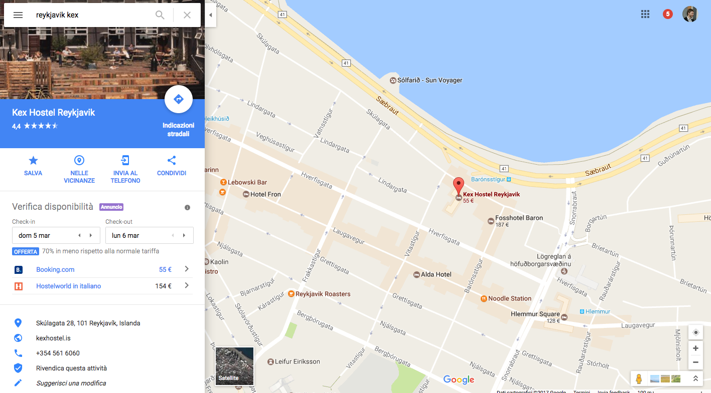
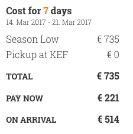
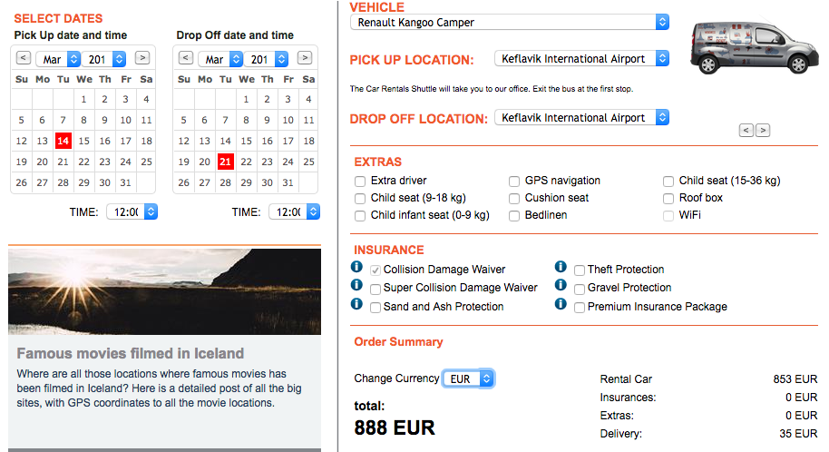

## 13-3-17 **AIRPLANE**: TURIN - LONDON || 15:25 - 16:15 || ERKXX58 || EASYJET
 - Il checkin è già effettuato
 - Le carte d'imbarco sono già nella cartella

## 13-3-17 **AIRPLANE**: LONDON - REYKJAVIK || 19:50 - 23:50 || JENDFD || ??
 - **Il checkin lo facciamo in aeroporto!!**
 - l'e-ticket è già nella cartella

## 13-3-17 **OSTELLO**:

## 14-3-17 **CAMPER**:
 - Opzione A

 - Opzione B

## 22-3-17 **AIRPLANE**: REYKJAVIK - BERLIN || 6:10 - 10:45 || 3YYF0K ||  WOWAIR
 - **Fare check-in!**
 - C'è un pdf nella cartella

## 27-3-17 **AIRPLANE**: BERLIN - TURIN || 21:15 - 22:55 || E9EZ6A || BLUEAIR
 - **Fare il check-in!**
 - Nessun documento